# AWS Three-Tier DevSecOps Platform


A production-style **Three-Tier DevSecOps Platform** built on **Amazon Web Services (AWS)** using **Terraform**, **Amazon EKS**, **GitHub Actions**, **Docker**, **Helm**, and **Kubernetes**.

The project demonstrates an end-to-end DevOps workflow—from provisioning cloud infrastructure using Infrastructure as Code (IaC) to automated application deployment, security scanning, monitoring, and HTTPS-enabled application delivery.

## Table of Contents

- Overview
- Architecture
- Features
- Project Highlights
- Solution Architecture
- Technology Stack
- Repository Structure
- Terraform Modules
- Prerequisites
- Deployment Guide
- Deployment Workflow
- Troubleshooting
- Common Commands
- Verification Checklist
- Lessons Learned
- Future Enhancements
- Screenshots
- Contributing
- Changelog
- License

> **Application Stack**
>
> - Frontend: React
> - Backend: Node.js (Express)
> - Database: MongoDB

---

## Architecture

> **Architecture Diagram**

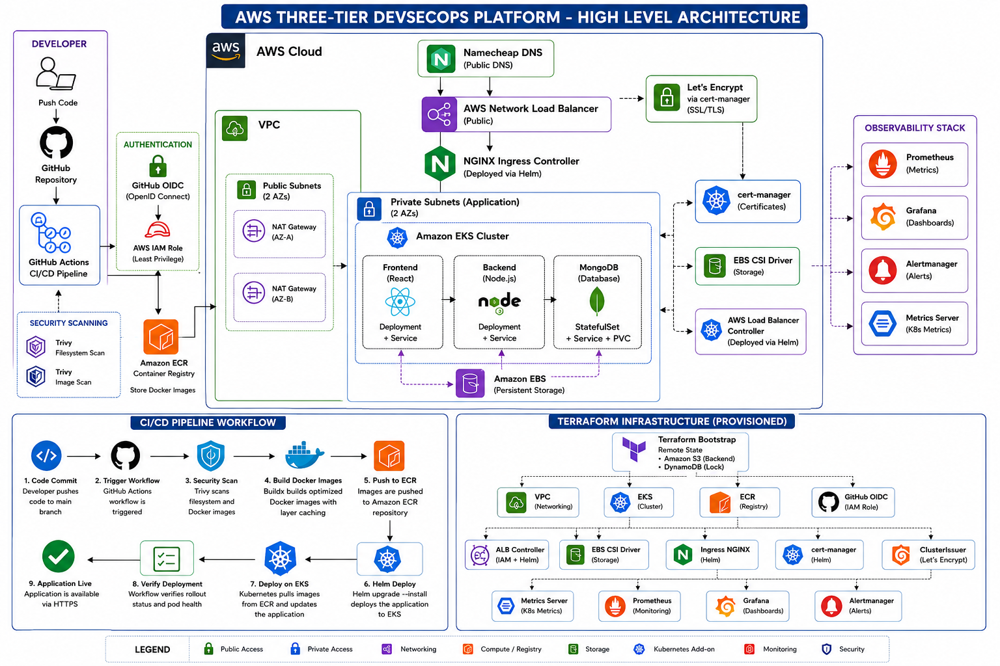

## Architecture Components

- Infrastructure Layer
- CI/CD Layer
- Kubernetes Layer
- Monitoring Layer
- Security Layer

---

## Features

### Infrastructure as Code

- Modular Terraform architecture
- Remote Terraform State using Amazon S3
- State Locking using DynamoDB
- Reusable Terraform modules
- Environment-based deployment (dev / qa / prod)

### Cloud Infrastructure

- Amazon VPC
- Public & Private Subnets
- Internet Gateway
- NAT Gateway
- Amazon EKS
- Amazon ECR
- IAM Roles & Policies

### Kubernetes

- Amazon EKS Cluster
- Managed Node Groups
- Helm Package Manager
- NGINX Ingress Controller
- AWS Load Balancer Controller
- Metrics Server
- EBS CSI Driver

### CI/CD

- GitHub Actions
- GitHub OIDC Authentication
- Docker Buildx
- Docker Layer Cache
- Automatic Image Build
- Automatic Image Push to Amazon ECR
- Automatic Helm Deployment
- Deployment Verification
- Workflow Concurrency Protection

### Security

- Trivy Filesystem Scan
- Trivy Image Scan
- GitHub OIDC (No Long-Lived AWS Keys)
- Least Privilege IAM Roles
- HTTPS using Let's Encrypt
- cert-manager Automatic Certificate Management

### Monitoring

- Prometheus
- Grafana
- Alertmanager
- Kubernetes Metrics
- Node Metrics
- Application Metrics Ready

---

# Project Highlights

- Fully Automated Infrastructure Provisioning
- End-to-End CI/CD Pipeline
- Production-Style Kubernetes Deployment
- Automated SSL Certificate Management
- Infrastructure Monitoring
- Security Scanning
- Modular Terraform Design
- Production-Ready GitHub Actions Workflow

---

## Project Summary

| Item | Value |
|------|-------|
| Cloud | AWS |
| IaC | Terraform |
| Kubernetes | Amazon EKS |
| CI/CD | GitHub Actions |
| Registry | Amazon ECR |
| Monitoring | Prometheus + Grafana |
| Security | Trivy + OIDC |
| TLS | Let's Encrypt |
| Infrastructure Modules | 10+ |
| GitHub Workflow Jobs | 3 |

---

## AWS Resources Provisioned

- 1 VPC
- 2 Public Subnets
- 2 Private Subnets
- 1 Internet Gateway
- 1 NAT Gateway
- 1 Amazon EKS Cluster
- 1 Managed Node Group
- 2 Amazon ECR Repositories
- 1 Network Load Balancer
- 1 GitHub OIDC Provider
- 5+ IAM Roles
- Prometheus
- Grafana
- Alertmanager

---

# Solution Architecture

The project follows a production-style Three-Tier architecture deployed on Amazon EKS.

```
                    Developer
                        │
                        ▼
                  GitHub Repository
                        │
                        ▼
                GitHub Actions (CI/CD)
                        │
        ┌───────────────┼────────────────┐
        │               │                │
        ▼               ▼                ▼
  Security Scan     Build Images     Push Images
      (Trivy)          (Docker)      Amazon ECR
                        │
                        ▼
               Helm Deployment
                        │
                        ▼
                Amazon EKS Cluster
                        │
                NGINX Ingress Controller
                        │
          AWS Load Balancer (Public)
                        │
                        ▼
                https://deepakkine.online
                        │
        ┌───────────────┼────────────────┐
        ▼               ▼                ▼
   React Frontend   Node.js Backend   MongoDB
                        │
                        ▼
                 Amazon EBS Storage

──────────────────────────────────────────────

Infrastructure Monitoring

Prometheus
Grafana
Alertmanager
Metrics Server

──────────────────────────────────────────────

Certificate Management

cert-manager
Let's Encrypt
Automatic TLS Certificate Renewal
```

---

# End-to-End Deployment Workflow

The deployment process is fully automated using GitHub Actions and Infrastructure as Code.

## Step 1 – Infrastructure Provisioning

Terraform provisions the AWS infrastructure including:

- Amazon VPC
- Public & Private Subnets
- Internet Gateway
- NAT Gateway
- Amazon EKS Cluster
- Managed Node Groups
- Amazon ECR
- IAM Roles
- GitHub OIDC Provider
- EBS CSI Driver
- AWS Load Balancer Controller
- NGINX Ingress Controller
- Metrics Server
- cert-manager
- ClusterIssuer
- Prometheus
- Grafana

---

## Step 2 – Application Development

The application source code consists of:

- React Frontend
- Node.js Backend
- MongoDB Database

---

## Step 3 – Source Control

The complete application and infrastructure code is maintained in GitHub.

Every push to the **main** branch automatically triggers the CI/CD pipeline.

---

## Step 4 – Security Scanning

GitHub Actions performs security checks before building the application.

Security scans include:

- Trivy Filesystem Scan
- Trivy Docker Image Scan

This helps detect vulnerabilities early in the pipeline.

---

## Step 5 – Docker Image Build

GitHub Actions builds Docker images for:

- Frontend
- Backend

Docker Buildx and layer caching are used to reduce build times.

---

## Step 6 – Push Images to Amazon ECR

Successfully built Docker images are pushed to Amazon Elastic Container Registry (ECR).

Images are versioned using the GitHub Actions run number.

Example:

```
backend:v25
frontend:v25
```

---

## Step 7 – Kubernetes Deployment

GitHub Actions connects to Amazon EKS using GitHub OIDC authentication.

The application is deployed using Helm.

Deployment includes:

- Frontend Deployment
- Backend Deployment
- MongoDB Deployment
- Services
- Ingress
- Secrets
- ConfigMaps
- Persistent Volume Claim

---

## Step 8 – HTTPS Configuration

The Ingress resource automatically requests TLS certificates using:

- cert-manager
- Let's Encrypt

Certificates are automatically renewed before expiration.

---

## Step 9 – Monitoring

Infrastructure and Kubernetes metrics are collected using:

- Prometheus
- Grafana
- Alertmanager
- Metrics Server

Monitoring dashboards provide visibility into:

- Cluster Health
- Pod Status
- CPU Usage
- Memory Usage
- Network Usage

---

## Step 10 – Application Access

Users access the application securely through:

```
https://deepakkine.online
```

Traffic Flow:

Internet

↓

AWS Load Balancer

↓

NGINX Ingress Controller

↓

Frontend Service

↓

Backend Service

↓

MongoDB

---

## Technology Stack

The project uses modern DevOps tools and AWS managed services to provision infrastructure, automate deployments, secure workloads, and monitor the Kubernetes environment.

| Category | Technology |
|----------|------------|
| **Cloud Provider** | Amazon Web Services (AWS) |
| **Infrastructure as Code** | Terraform |
| **Containerization** | Docker |
| **Container Registry** | Amazon Elastic Container Registry (ECR) |
| **Container Orchestration** | Amazon Elastic Kubernetes Service (EKS) |
| **Package Manager** | Helm |
| **CI/CD** | GitHub Actions |
| **Source Code Management** | Git & GitHub |
| **Authentication** | GitHub OIDC + AWS IAM |
| **Ingress Controller** | NGINX Ingress Controller |
| **Load Balancer** | AWS Load Balancer Controller |
| **Persistent Storage** | Amazon EBS CSI Driver |
| **Monitoring** | Prometheus |
| **Visualization** | Grafana |
| **Alerting** | Alertmanager |
| **Metrics Collection** | Metrics Server |
| **Certificate Management** | cert-manager |
| **SSL/TLS** | Let's Encrypt |
| **Security Scanning** | Trivy |
| **Frontend** | React |
| **Backend** | Node.js (Express) |
| **Database** | MongoDB |

---

## Repository Structure

```text
aws-three-tier-devsecops-platform
│
├── .github/
│   └── workflows/
│       └── ci-cd.yml                 # GitHub Actions CI/CD Pipeline
│
├── app/
│   ├── frontend/                     # React Application
│   └── backend/                      # Node.js REST API
│
├── helm/
│   └── three-tier-app/               # Helm Chart
│       ├── templates/
│       ├── Chart.yaml
│       └── values.yaml
│
├── terraform/
│   ├── bootstrap/                    # S3 Backend & DynamoDB Lock
│   ├── environments/
│   │   ├── dev/
│   │   ├── qa/
│   │   └── prod/
│   │
│   └── modules/
│       ├── vpc/
│       ├── eks/
│       ├── ecr/
│       ├── github-oidc/
│       ├── alb-controller/
│       ├── ingress-nginx/
│       ├── cert-manager/
│       ├── cluster-issuer/
│       ├── metrics-server/
│       └── monitoring/
│
├── monitoring/
│   ├── dashboards/
│   ├── alerts/
│   ├── grafana/
│   └── loki/
│
├── security/
│   └── trivy/
│
├── scripts/
│
├── docs/
│   ├── architecture.png
│   ├── cicd-pipeline.png
│   ├── terraform-modules.png
│   └── screenshots/
│
├── docker-compose.yml
│
└── README.md
```

---

# Terraform Module Overview

The infrastructure is organized into reusable Terraform modules.

| Module | Description |
|---------|-------------|
| **bootstrap** | Creates the S3 backend and DynamoDB state locking resources |
| **vpc** | Creates the VPC, public/private subnets, route tables, NAT Gateway, and Internet Gateway |
| **eks** | Creates the Amazon EKS Cluster, Managed Node Groups, IAM Roles, Security Groups, and OIDC Provider |
| **ecr** | Creates Amazon ECR repositories for the application images |
| **github-oidc** | Configures GitHub OIDC authentication and IAM Role for GitHub Actions |
| **alb-controller** | Installs AWS Load Balancer Controller and configures IAM permissions |
| **ingress-nginx** | Installs the NGINX Ingress Controller using Helm |
| **cert-manager** | Installs cert-manager for automated TLS certificate management |
| **cluster-issuer** | Creates the Let's Encrypt ClusterIssuer resource |
| **metrics-server** | Installs Kubernetes Metrics Server |
| **monitoring** | Deploys Prometheus, Grafana, and Alertmanager using kube-prometheus-stack |

---

# Application Components

The application follows a standard Three-Tier architecture.

## Frontend

- React
- NGINX Web Server
- Docker Container
- Kubernetes Deployment
- Kubernetes Service

---

## Backend

- Node.js
- Express.js
- REST API
- Docker Container
- Kubernetes Deployment
- Kubernetes Service

---

## Database

- MongoDB
- Persistent Volume Claim
- Amazon EBS Storage
- Kubernetes Deployment
- Kubernetes Service

---

# Prerequisites

Before deploying the project, ensure the following tools and accounts are available.

## AWS

- AWS Account
- IAM User with AdministratorAccess (or equivalent permissions)
- AWS CLI configured

```bash
aws configure
```

---

## Required Tools

| Tool | Version |
|-------|----------|
| Terraform | >= 1.7 |
| kubectl | Latest |
| Helm | >= 3.x |
| Docker | Latest |
| Git | Latest |
| AWS CLI | v2 |
| Node.js *(optional)* | >= 20 |

Verify the installation:

```bash
terraform version
kubectl version --client
helm version
docker --version
git --version
aws --version
```

---

## GitHub

Create a GitHub repository and configure the following secrets.

| Secret | Description |
|----------|-------------|
| AWS_REGION | AWS Region |
| AWS_ACCOUNT_ID | AWS Account ID |

> Authentication is performed using GitHub OIDC. Long-lived AWS access keys are **not required**.

---

## Domain

Purchase a domain (Namecheap was used in this project).

Example:

```
deepakkine.online
```

Configure DNS after the Ingress LoadBalancer is created.

---

# Deployment Guide

The deployment is divided into multiple stages.

---

## Step 1 — Clone Repository

```bash
git clone https://github.com/<your-github-username>/aws-three-tier-devsecops-platform.git

cd aws-three-tier-devsecops-platform
```

---

## Step 2 — Configure Terraform Variables

Copy the example configuration.

```bash
cp terraform/environments/dev/terraform.tfvars.example \
terraform/environments/dev/terraform.tfvars
```

Update:

- AWS Region
- GitHub Repository
- GitHub Username
- Let's Encrypt Email
- Alertmanager Email

---

## Step 3 — Create Terraform Backend

Navigate to:

```text
terraform/bootstrap
```

Initialize Terraform.

```bash
terraform init
```

Deploy.

```bash
terraform apply
```

This creates:

- S3 Backend
- DynamoDB Lock Table

---

## Step 4 — Deploy Infrastructure

Navigate to:

```text
terraform/environments/dev
```

Initialize Terraform.

```bash
terraform init
```

Validate.

```bash
terraform validate
```

Review the plan.

```bash
terraform plan
```

Deploy.

```bash
terraform apply
```

Terraform provisions:

- VPC
- Public Subnets
- Private Subnets
- NAT Gateway
- Internet Gateway
- EKS Cluster
- Managed Node Group
- ECR Repositories
- GitHub OIDC
- AWS Load Balancer Controller
- Metrics Server
- NGINX Ingress
- cert-manager
- ClusterIssuer
- kube-prometheus-stack

---

## Step 5 — Configure kubectl

```bash
aws eks update-kubeconfig \
--region ap-south-1 \
--name aws-three-tier-devsecops-platform-dev
```

Verify.

```bash
kubectl get nodes
```

---

## Step 6 — Verify Infrastructure

```bash
kubectl get pods -A

kubectl get ingress -A

kubectl get certificate -A

helm list -A
```

All resources should be in the **Running** state.

---

## Step 7 — Configure DNS

After the NGINX LoadBalancer is created, obtain the hostname.

```bash
kubectl get svc -n ingress-nginx
```

Example:

```
xxxxxxxx.elb.ap-south-1.amazonaws.com
```

Create the following DNS records.

| Host | Type |
|-------|------|
| @ | CNAME |
| www | CNAME |
| grafana | CNAME |
| prometheus | CNAME |

Point all records to the LoadBalancer hostname.

---

## Step 8 — Wait for TLS Certificates

Verify.

```bash
kubectl get certificate -A
```

Expected output:

```
READY=True
```

Certificates are issued automatically by Let's Encrypt through cert-manager.

---

## Step 9 — Push Application

Push code to GitHub.

```bash
git push origin main
```

GitHub Actions automatically:

- Security Scan
- Build Docker Images
- Push Images to ECR
- Deploy Helm Chart
- Verify Kubernetes Rollout

No manual deployment is required.

---

## Step 10 — Verify Application

Open:

```
https://deepakkine.online
```

Monitoring:

```
https://grafana.deepakkine.online

https://prometheus.deepakkine.online
```

The application should be available over HTTPS with valid Let's Encrypt certificates.

---

## CI/CD Pipeline Workflow

```text
Developer
      │
      ▼
Git Push
      │
      ▼
GitHub Actions
      │
      ▼
Trivy Security Scan
      │
      ▼
Docker Build
      │
      ▼
Amazon ECR
      │
      ▼
Helm Upgrade
      │
      ▼
Amazon EKS
      │
      ▼
NGINX Ingress
      │
      ▼
Application Available
```

---

## Troubleshooting

During the development of this project, several real-world deployment challenges were encountered. The following sections document the issues, their root causes, and the resolutions.

---

# CI/CD Issues

## GitHub Actions failed to authenticate with AWS

**Issue**

GitHub Actions could not authenticate with AWS.

**Cause**

The workflow initially relied on long-lived AWS Access Keys.

**Resolution**

- Configured GitHub OIDC.
- Created an IAM Role for GitHub Actions.
- Granted the minimum required IAM permissions.
- Removed AWS Access Keys from the workflow.

---

## GitHub OIDC Provider already existed

**Issue**

Terraform failed while creating the GitHub OIDC Provider.

**Cause**

The OIDC Provider already existed in the AWS account.

**Resolution**

- Reused the existing OIDC Provider.
- Updated the Terraform configuration to avoid duplicate resource creation.

---

## GitHub Actions could not access Amazon EKS

**Issue**

The deployment workflow failed while executing Kubernetes commands.

**Cause**

The GitHub IAM Role was not authorized to access the EKS cluster.

**Resolution**

- Added an EKS Access Entry.
- Associated the `AmazonEKSClusterAdminPolicy` with the GitHub IAM Role.

---

## Docker images were not pushed to Amazon ECR

**Issue**

Docker push failed.

**Cause**

GitHub Actions was not authenticated with Amazon ECR.

**Resolution**

Configured the Amazon ECR Login GitHub Action before building and pushing Docker images.

---

## GitHub workflow executed multiple deployments simultaneously

**Issue**

Multiple pushes triggered overlapping Helm deployments.

**Cause**

GitHub Actions allows concurrent workflow execution by default.

**Resolution**

Added a concurrency block to the workflow to ensure only one deployment runs at a time.

---

# Terraform Issues

## Remote State Backend

**Issue**

Terraform state could not be shared safely.

**Cause**

No remote backend was configured.

**Resolution**

Configured:

- Amazon S3 for remote state
- DynamoDB for state locking

---

## ClusterIssuer was not created

**Issue**

cert-manager was installed successfully but no ClusterIssuer existed.

**Cause**

The ClusterIssuer was managed manually.

**Resolution**

Created a reusable Terraform module to provision the ClusterIssuer automatically.

---

## Monitoring Ingress failed

**Issue**

Terraform failed while creating the Monitoring Ingress.

**Cause**

The monitoring namespace had not yet been created.

**Resolution**

Added explicit Terraform dependencies using `depends_on`.

---

## Terraform Destroy Failed with OpenAPI Timeout

### Error

```text
Error: Plugin error

failed get OpenAPI spec: context deadline exceeded
```

### Cause

Terraform attempted to destroy Kubernetes resources while the Kubernetes provider could not communicate with the EKS API server.

### Resolution

Verify cluster connectivity.

```bash
kubectl get nodes

helm list -A
```

If required, refresh kubeconfig.

```bash
aws eks update-kubeconfig \
  --region ap-south-1 \
  --name aws-three-tier-devsecops-platform-dev
```

Destroy Kubernetes resources first.

```bash
terraform destroy \
  -target=module.monitoring \
  -target=module.ingress_nginx \
  -target=module.cert_manager \
  -target=module.cluster_issuer \
  -target=kubernetes_ingress_v1.monitoring \
  -target=helm_release.aws_load_balancer_controller \
  -auto-approve
```

Finally destroy the remaining infrastructure.

```bash
terraform destroy -auto-approve
```

---

# Kubernetes Issues

## kubectl could not connect to Amazon EKS

**Issue**

kubectl returned connection errors.

**Cause**

The kubeconfig referenced an outdated cluster endpoint.

**Resolution**

Updated the kubeconfig.

```bash
aws eks update-kubeconfig \
  --region ap-south-1 \
  --name aws-three-tier-devsecops-platform-dev
```

---

## Helm deployment failed

### Error

```text
another operation is in progress
```

### Cause

A previous Helm upgrade had not completed.

### Resolution

Waited for the existing Helm operation to complete and added GitHub Actions concurrency control.

---

## Kubernetes rollout verification failed

**Issue**

The deployment verification step failed.

**Cause**

Incorrect Deployment names were used in the workflow.

**Resolution**

Updated the rollout commands to match the Helm-generated Deployment names.

---

## Backend and Frontend communication failed

**Issue**

The frontend could not reach the backend API.

**Cause**

The backend URL was not passed during the frontend image build.

**Resolution**

Added:

```text
REACT_APP_BACKEND_URL=/api/tasks
```

as a Docker build argument.

---

# Networking & DNS Issues

## Application returned NXDOMAIN

**Issue**

The application domain could not be resolved.

**Cause**

DNS records were not configured correctly in Namecheap.

**Resolution**

Updated the CNAME records to point to the NGINX Ingress LoadBalancer.

---

## Application was not reachable

**Issue**

The application could not be accessed through the domain.

**Cause**

Ingress was configured correctly but DNS records pointed elsewhere.

**Resolution**

Updated all DNS records to the AWS LoadBalancer hostname.

---

## HTTPS Certificate remained READY=False

**Issue**

TLS certificates were not issued.

**Cause**

DNS propagation was incomplete.

**Resolution**

Waited for DNS propagation and allowed cert-manager to retry the ACME challenge.

---

## HTTPS certificate was never created

**Issue**

No TLS Secret was created.

**Cause**

The ClusterIssuer resource did not exist.

**Resolution**

Managed the ClusterIssuer through Terraform.

---

# Monitoring Issues

## Grafana and Prometheus were inaccessible

**Issue**

Monitoring dashboards were not reachable.

**Cause**

Ingress resources had not been configured.

**Resolution**

Configured dedicated Ingress resources for:

- Grafana
- Prometheus

---

## Monitoring certificates were not issued

**Issue**

Grafana and Prometheus HTTPS certificates remained Pending.

**Cause**

Let's Encrypt could not validate the domain before DNS propagation.

**Resolution**

Updated DNS records and waited for certificate issuance.

---

# Security Improvements

During the project, the following security improvements were implemented.

- Replaced AWS Access Keys with GitHub OIDC authentication.
- Implemented IAM Roles for Service Accounts (IRSA).
- Added Trivy filesystem scanning.
- Added Trivy container image scanning.
- Enabled HTTPS using Let's Encrypt.
- Eliminated long-lived AWS credentials from GitHub Secrets.
- Restricted GitHub Actions to least-privilege IAM permissions.

---

# Common Commands

## Terraform

```bash
terraform init
terraform validate
terraform plan
terraform apply
terraform destroy
```

---

## Kubernetes

```bash
kubectl get nodes

kubectl get pods -A

kubectl get svc -A

kubectl get ingress -A

kubectl get certificate -A

kubectl get events -A
```

---

## Helm

```bash
helm list -A

helm history three-tier-app -n three-tier-app

helm status three-tier-app -n three-tier-app

helm upgrade --install ...
```

---

## AWS

```bash
aws sts get-caller-identity

aws eks update-kubeconfig \
--region ap-south-1 \
--name aws-three-tier-devsecops-platform-dev

aws ecr describe-repositories

aws eks describe-cluster \
--name aws-three-tier-devsecops-platform-dev
```

---

# Verification Checklist

After deployment, verify the following:

- Terraform completed successfully
- EKS Cluster is Active
- Node Group is Ready
- All Kubernetes Pods are Running
- Ingress Controller is Running
- AWS Load Balancer Controller is Running
- cert-manager is Running
- ClusterIssuer status is `READY=True`
- TLS Certificates are `READY=True`
- GitHub Actions completed successfully
- Docker images exist in Amazon ECR
- Application is accessible via HTTPS
- Grafana dashboard is accessible
- Prometheus is accessible
- Alertmanager is operational

---

# Lessons Learned

This project provided hands-on experience with:

- Designing reusable Terraform modules
- Provisioning production-style AWS infrastructure
- Implementing GitHub OIDC authentication
- Deploying applications to Amazon EKS using Helm
- Managing Kubernetes Ingress resources
- Automating TLS certificate issuance with cert-manager
- Configuring Let's Encrypt for Kubernetes workloads
- Building secure CI/CD pipelines with GitHub Actions
- Monitoring Kubernetes clusters with Prometheus and Grafana
- Troubleshooting real-world Kubernetes, Helm, Terraform, and AWS integration issues

---

# Future Enhancements

Planned improvements include:

- Argo CD for GitOps deployments
- Loki and Promtail for centralized logging
- Horizontal Pod Autoscaler (HPA)
- Karpenter for dynamic node provisioning
- ExternalDNS for automatic DNS record management
- Amazon Route 53 integration
- SonarQube for code quality analysis
- Multi-environment deployments (Dev, QA, Production)
- Blue/Green or Canary deployments
- Slack and Microsoft Teams notifications

---

# Screenshots

## 1. GitHub Repository

> Repository containing the complete source code, Terraform modules, Helm charts, GitHub Actions workflows, and project documentation.

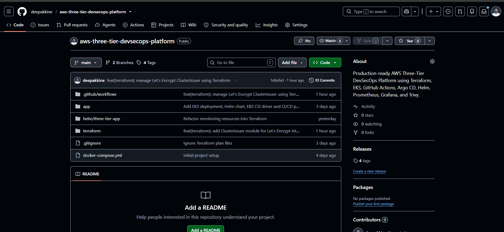

---

## 2. GitHub Actions CI/CD Pipeline

> Successful CI/CD pipeline showing Security Scan, Build & Push, and Deployment to Amazon EKS.

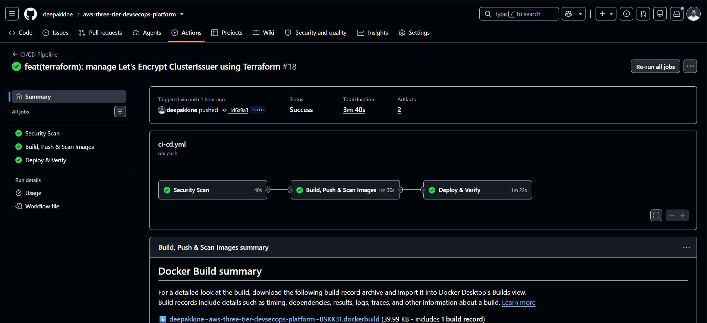

---

## 3. Amazon Elastic Container Registry (ECR)

> Backend and Frontend Docker images stored in Amazon ECR.

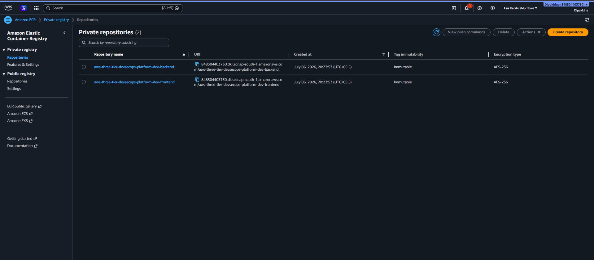

---

## 4. Amazon EKS Cluster

> Amazon EKS cluster provisioned using Terraform.

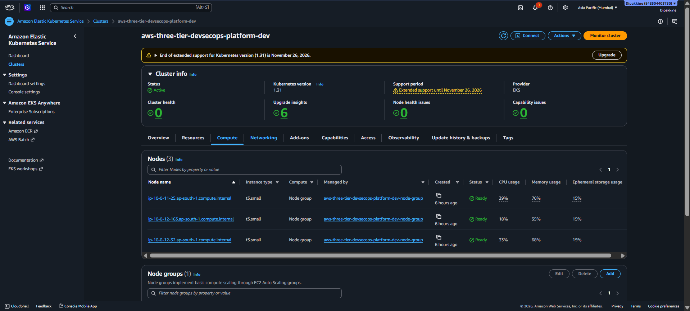

---

## 5. Amazon EKS Managed Node Groups

> Healthy EKS managed node group hosting the Kubernetes worker nodes.

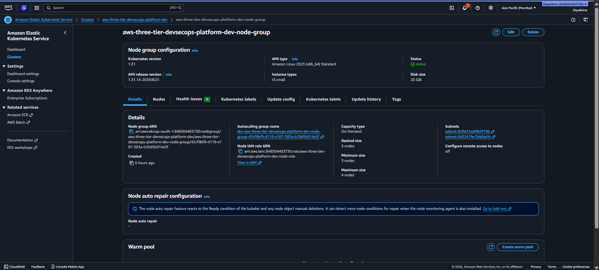

---

## 6. EC2 Instances created on Worker Nodes

> Amazon EC2 instances provisioned automatically by the EKS managed node group.

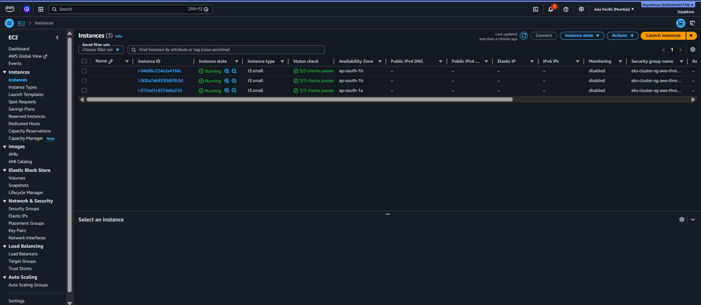

---

## 7. IAM Roles

> IAM Roles created for GitHub Actions OIDC, EKS Cluster, EKS Node Group, AWS Load Balancer Controller, and EBS CSI Driver.

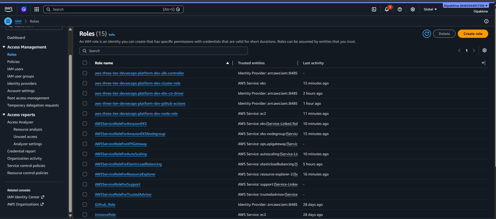

---

## 8. AWS Network Load Balancer

> Network Load Balancer automatically provisioned by the NGINX Ingress Controller.

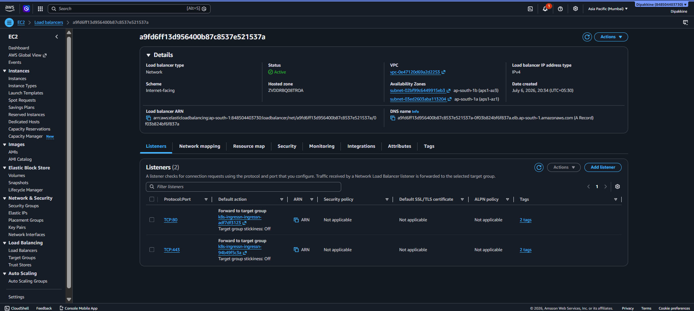

---

## 9. Helm Releases

> Helm releases deployed in the Kubernetes cluster.

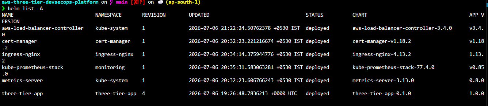

---

## 10. Kubernetes Pods

> All application and infrastructure pods running successfully.

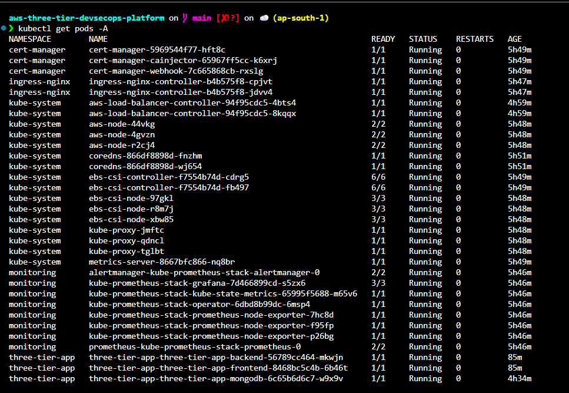

---

## 11. Kubernetes Ingress

> NGINX Ingress exposing the application and monitoring services.

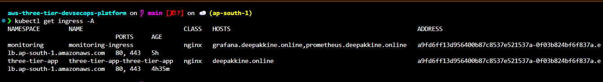

---

## 12. TLS Certificates

> Let's Encrypt certificates successfully issued by cert-manager.

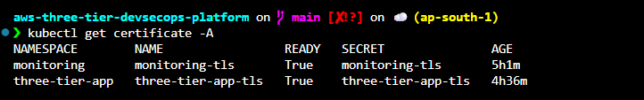

---

## 13. Grafana Dashboard

> Grafana dashboard visualizing Kubernetes infrastructure and application metrics.

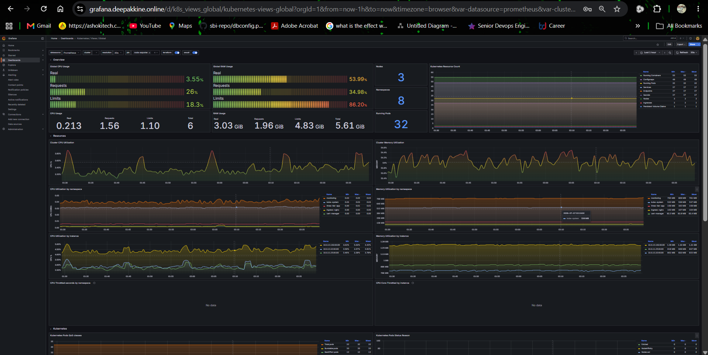

---

## 14. Prometheus Targets

> Prometheus successfully scraping Kubernetes and application metrics.

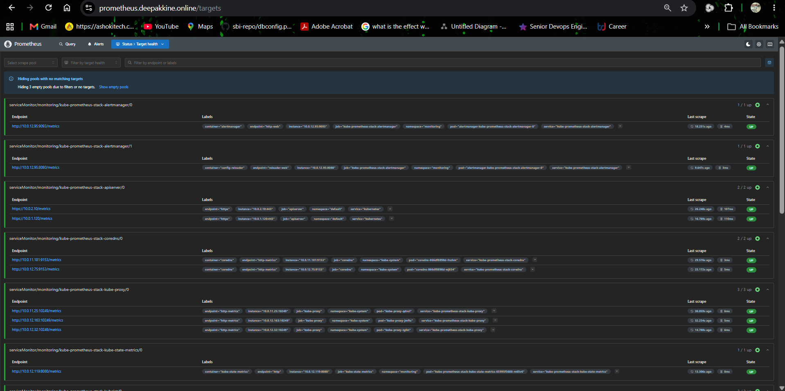

---

## 15. Three-Tier Application

> React frontend communicating with the Node.js backend over HTTPS through the NGINX Ingress Controller.

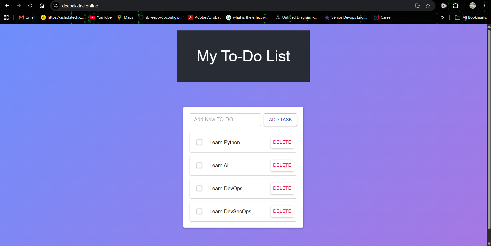

---

## Contributing

Contributions, issues, and feature requests are welcome.

Feel free to fork the repository and submit pull requests.

---

## Changelog

See CHANGELOG.md for project updates.

---

## Author

**Dipak Kine**

DevOps Engineer

GitHub:
https://github.com/deepakkine

LinkedIn:
https://www.linkedin.com/in/dipak-k-903a343b9/

Email:
kinedipak97@gmail.com

---

## References

- Terraform Documentation
- Kubernetes Documentation
- Helm Documentation
- AWS EKS Documentation
- cert-manager Documentation
- Prometheus Documentation

---

## License

This project is licensed under the MIT License.

See the LICENSE file for details.
